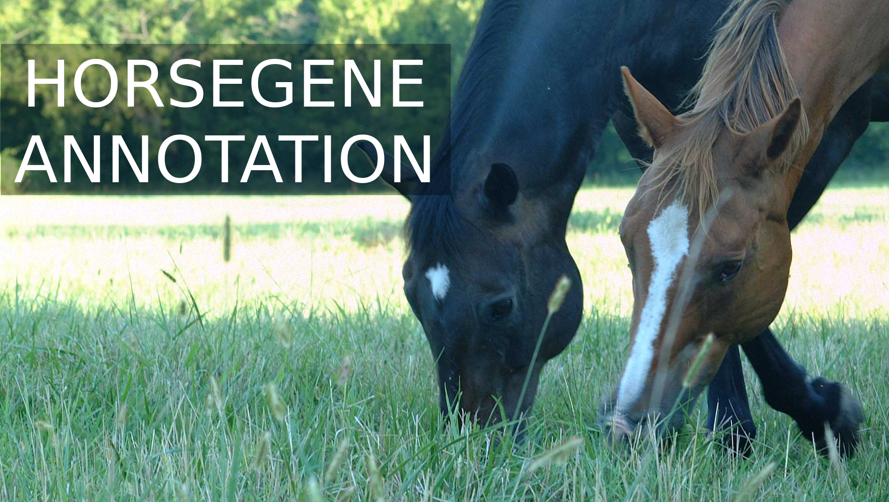

Welcome! This is the README file for HorseGeneAnnotation: a manually-curated,
crowd-sourced gene annotation website for the horse. This repo contains all of
the source code, documentation, tutorials, and project tracking for the
HorseGeneAnnotation project. Continue reading below for a quick introduction into
the problem we are trying to solve, or visit our [Contribution Guide](CONTRIBUTING.md) 
to get started right away!

## Summary 🐴
In order to study genetics and genomics in non-model and agricultural species, 
researchers rely on a reference genome to design experiments. Many of these 
research communities rely on reference genomes where genes were discovered and 
annotated computationally. **You** can help scientists curate and correct many of
the small errors that computers are not good at fixing! Using this website you 
will learn more about what genomes are and how they are studied and you will
identify and correct issues and inconsistencies associated with the Equine 
reference genome!

## To study genomics you need a genome 
Genetics studies how changes in DNA changes can affect a living organism.
Similarly, genomics investigates the entirety of an organism's DNA-sequence --
its genome. Since everyone (except twins and clones!) has a different genome,
it can be difficult to organize experiments. Researchers studying genetics and
genomics collectively rely on a reference genome in order to make comparisons 
among different individuals. This way, when a scientist finds what they think 
is a change in the DNA, or a mutation, they can compare it to the reference 
genome in order to design experiments. 

Generating a reference genome costs a lot of money -- but it is getting better.
The cost to sequence the first *human* genome was nearly 3
billion[1](#f1) dollars! Due to rapid advances in technology and
an emerging biomedical market, a genome today only takes ~$1000 dollars to
sequence[2](#f2). This is a pretty good deal, considering that the
human genome is composed of nearly 3.2 billion base pairs, the unit of
information in DNA[3](#f3). This advance in technology has also
enabled reasearchers and scientists who study genetics in other organisms
to draft and assemble their own genomes. In 2009, less than a decade after the
human genome was completed, the nearly 2.7 billion base pairs of the equine
genome were sequenced and made available to the public[4](#f4).

## A finished reference genome isn't done
A genome is **massive**. If you printed yours out on paper, it would fill a
book case. It almost unbelievable that almost every cell in your body contains
a full copy of your DNA. As you can imagine, despite our best attempts,
while fully sequencing a genome, errors were introduced. Imagine that even if
you were 99.999% accurate while assembling a genome and the genome you
were assembling was 3 billion base pairs, you'd still end up with approximately
3 million errors introduced in your reference!

There were thousands of people[5](#f5) working on the human genome
project. Today, we have genome projects for hundreds of different non-model and
agricultural species. Most of these teams consist of a handful of researchers
who are dedicated to knowing more about frogs, alligators, falcons, hedgehogs,
gorillas, bats, walruses, beetles, and yes, horses[6](#f6).  

🐶 🐱 🐭 🐹 🐰 🦊 🐻 🐼 🐨 🐯 🦁 🐮 🐷 🐸 🐵 🐔 🐧 🐦 🐤 🦆 🦅 🦉 🦇 🐺 🐗 🐴 🐝 🐛 🦋 🐌 🐚 🐞 🐜 🕷 🦂 🐢 🐍 
🦎 🐙 🦑 🦐 🦀 🐡 🐠 🐟 🐳 🦈 🐊 🐅 🐆 🦓 🦍 🐘 🦏 🐪 🐫 🦒 🐃 🐂 🐄 🐎 🐖 🐏 🐑 🐐 🦌 🐕 🐩 🐈 🐓 🦃 🐇 🐁 🐀  

Luckily, computers have made most the the process in drafting a reference genome a
streamlined process. However, there are still some things computers are just
not good at recognizing or resolving.

## We need your help!
Our [lab](https://www.equine.umn.edu/research/equine-genetics-and-genomics-laboratory) 
studies equine genetics and genomics. We are very proud to be included in the list
of animals with a high quality sequenced reference genome. But the hard work is not over.

We are building a website that will turn anyone into a gene curator! Our goal
is to design a web-based interface that will teach people the basic anatomy of
what scientists look for in the genome. From there you'll be presented with
problematic gene models that were the result of small errors introduced by
automated computer pipelines. As a result, your efforts will help researchers
throughout the globe learn more about our world and the creatures that 
live in it. Also, your contributions will not go unnoticed! Your help will 
also earn you a spot in our contributors page!

We hope that our project will help anyone do the following:
1. Learn the fundamentals of what a genome is and how genes are encoded in it
2. Learn the anatomy of genes and how to spot when there are potential errors in the reference
3. Contribute curated gene models to a shared, public database that *real* researchers
will use in their science!

To get started, check out our [Contributing Guide](CONTRIBUTING.md)!

# References
- <a name='f1'>1</a>: https://www.genome.gov/11006943/human-genome-project-completion-frequently-asked-questions/ [↩](#t1)
- <a name='f2'>2</a>: https://www.genome.gov/27565109/the-cost-of-sequencing-a-human-genome/ [↩](#t2)
- <a name='f3'>3</a>: https://en.wikipedia.org/wiki/Human_genome [↩](#t3)
- <a name='f4'>4</a>: https://www.sciencedaily.com/releases/2009/11/091105143708.htm [↩](#f4)
- <a name='f5'>5</a>: https://www.genome.gov/dnaday/q.cfm?aid=402&year=2007 [↩](#f5)
- <a name='f6'>6</a>: https://en.wikipedia.org/wiki/List_of_sequenced_animal_genomes [↩](#f6)

# Acknowledgements
- Banner image provided [hasan amar on Unsplash](https://unsplash.com/photos/CRUBL_FDUOI)
