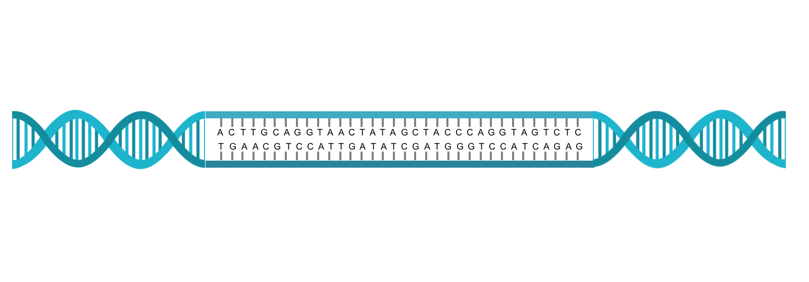
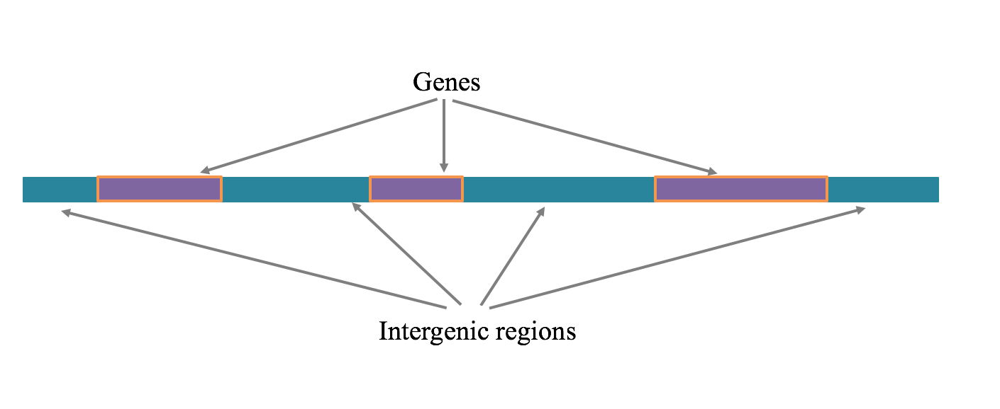
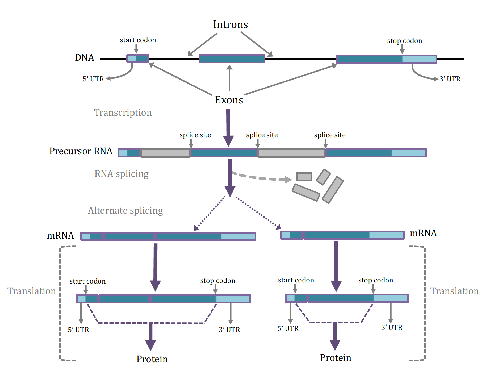
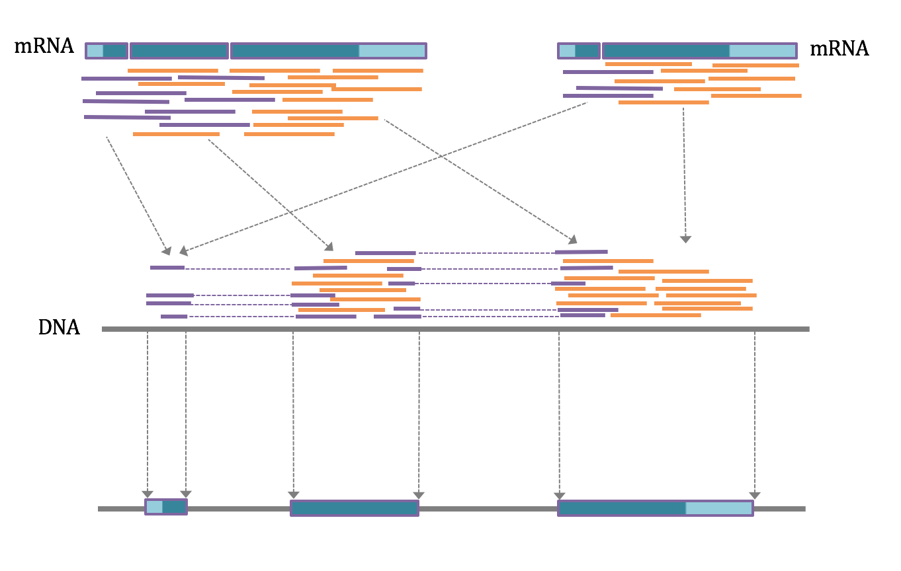

# WHAT IS GENE ANNOTATION? 

To understand what is meant by gene annotation, it is first important to understand the structure and function of genes within
the genome. The **genome** contains all the genetic material of an individual and is made up of deoxyribonucleic acid (DNA). 
**DNA** in cells is actually a **double helix** containing strands of chemical **bases** (A, C, T, G) in a precise order that
aligns with the opposing strand into units called base pairs *(Figure 1)*.  The genomes of higher organisms typically have 
from 1 – 3 billion base pairs of DNA in their genomes.  Almost all cells in the body have an entire copy of the genome that is 
organized into **chromosomes** that contain the DNA and some associated proteins. Each **chromosome** has a single very long 
strand of DNA containing **genes** and **intergenic regions** *(Figure 2)*. There are approximately 22,000 genes in each 
individual’s genome in which each gene has a specific and different sequence of the DNA bases.  There are two types of genes.
One is the protein-coding genes whose DNA sequences are transcribed into specific RNA (ribonucleic acid) sequences, which are 
then translated by the cell to synthesize proteins based on those sequences.  The other type of gene contains DNA that is 
transcribed into other types of RNAs such as long non-coding RNAs and micro RNAs that are not transcribed into proteins.  
Approximately 30% of the DNA of the genome is represented by such protein-coding and non-coding gene units. 

### Figure 1
{:class='figure'} 
> DNA double helix and base pairing of the strands.  The right and left sides show how two strands form a double helix.  The middle section shows how that strand of the is a actually a linear string of bases which can be A, T, C, or G.  The bases on each strand align into base pairs in which an A always pairs with a T and a C always pairs with a G.

### Figre 2
{:class='figure'}
> Genes and intergenic regions on a chromosomal segment.  A region of DNA is shown that contains both genes and intergenic regions.  The sequences of DNA bases within the genes can be transcribed into RNA, which can either be protein-coding or non-coding.

The DNA of a protein-coding gene is made up of **exons** and **introns** *(Figure 3A)*. As hinted at above, to convert a 
protein-coding gene into a protein, one of its DNA strands is first transcribed into a precursor RNA (transcription, *Figure 
3B*). The precursor RNA contains a sequence of bases complementary to the starting DNA’s exon and intron sequences. Before 
being used to make a protein, the intron sequences are removed from the RNA molecule by an RNA splicing process to create 
messenger RNA (mRNA, *Figure 3C*). This mRNA can contain all of a gene’s exons (*Figure 3D*) or sometimes only part of a 
gene’s exons due to alternate splicing (*Figure 3E*). The junctions between introns and exons are referred to as **splice 
sites** (*Figure 3*). The mRNAs created by transcription are also called transcripts and each gene can have more than one type 
of transcript due to the possibility of alternate splicing. Each transcript can be translated from mRNA into a specific 
sequence of amino acids in the process of protein synthesis (translation, *Figure 3F*). During translation the sequence of the 
RNA transcript is read in groups of 3 bases, called a codon, in which each codon encodes a specific amino acid. Translation 
starts at a 3 base pair **start codon**, and ends at the 3 base pair **stop codon**. The portion of the messenger RNA upstream 
of the start codon is not translated and is known as the 5’ untranslated region (5’ UTR); similarly, the portion of mRNA after
the stop codon is not translated and is known as the 3’ untranslated region (3’ UTR). 

### Figure 3
{:class='figure'}
> Structure of genes and formation of mRNAs and proteins.   A.  The DNA sequence within a gene is comprised of exons and introns.  One of the first exons has a start codon while the last exon has a stop codon, which are ultimately used for directing the synthesis of a protein.   The UTRs do not function in protein synthesis.  B.  A precursor RNA that has been transcribed from the gene contains both the exon and intron sequences, as well as splice sites that are the DNA bases at the junctions between exons and introns. The exons contain functional information for the eventual synthesis of protein while the intron sequences are discarded and the exons are spliced together.  C.  After splicing the transcript is termed a mRNA (messenger RNA) which contains a 5’ UTR, a start and a stop codon, and a 3’ UTR.   Many genes can be alternatively splicing, resulting in different combinations of the available exons can be present in the mRNA.  D.  The sequence of bases in the mRNA including and between the start and stop codons (but not including the 5’ and 3’ UTRs) are recognized as codons (3 consecutive bases) and utilized by the cellular machinery to synthesis a protein.  Alternative transcripts of a gene will produce proteins of different lengths and slightly different functions.

Genome **annotation** is the process of finding the precise locations of each of the individual genes along a chromosome’s DNA 
strand, and the locations of each gene’s features such as introns, exons, start and stop codons, splice sites and UTRs on the
original DNA sequences. Annotation of these elements for a single gene make up what is often referred to as a **gene model**.
For all organisms with a sequenced genome complete and correct annotation, or gene models, for all genes is a goal of genetic 
researchers. Annotation of a genome can be accomplished in several ways using dozens of different methods, that fall into 3 
general categories:

1. In silico (done by a computer) annotation uses gene models from other closely related species with a well-annotated
genome. Using another organism’s gene models are a good best guess at annotation, as important elements of gene models 
(start and stop codon sequences, splice site recognition sequences, and exon sequences) are often very highly conserved 
across species. These initial gene models are improved by the computer searching for missing stop or start codons, exons
or splice junctions, etc. in the DNA sequence of the species of interest.
    
2. In silico annotation with RNA sequences from the target species. mRNA sequences that are generated from the tissues
of theorganism at different life stages can also be used to improve annotation. By generating billions of mRNA sequences
from transcripts isolated from tissues, researchers can improve annotation by aligning these RNAs to the genome sequence
(*Figure 4*). 

### Figure 4
{:class='figure'}
> Identification of DNA exon sequences from mRNA sequence data.  After isolation of mRNA from cells and tissues these mRNAs can be sequenced to generate strands of sequence up to 150 bases long.  Depending on the lengths of the exons in the genes from which these mRNAs were generated, the mRNA sequences may be based entirely in a single exon (orange strands) or represent contributions from several exons (purple strands).   If the mRNA is alternatively spliced, the set of sequences will be derived from all spliced forms (left and right).   When the mRNA sequences are aligned with the original DNA sequence the orange sequences will be placed entirely within exons while the purple sequences will be placed in consecutive exons and separated by the original introns.  In this way the boundaries between exons and introns, and the precise locations of the splice sites are determined.

3. Annotation of genes can also be performed manually. Even with *in silico* predictions from the gene models of other
species,and with species-specific RNA sequencing, annotation can be incorrect. Therefore researchers often need to 
annotate genes by hand by comparing the annotations of other species directly to the annotation in the species of interest 
(see manual annotation tutorials).  

In summary, annotation helps give meaning to the genome’s DNA sequences and makes it much easier for researchers to analyze 
the impact of DNA sequence changes within individuals. 

